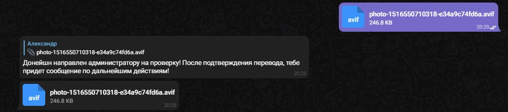
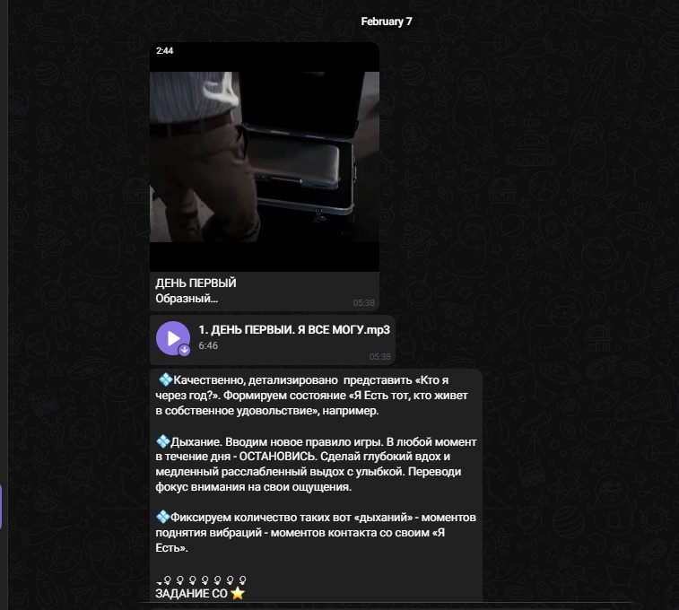
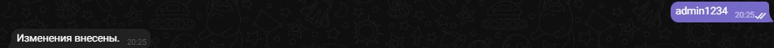
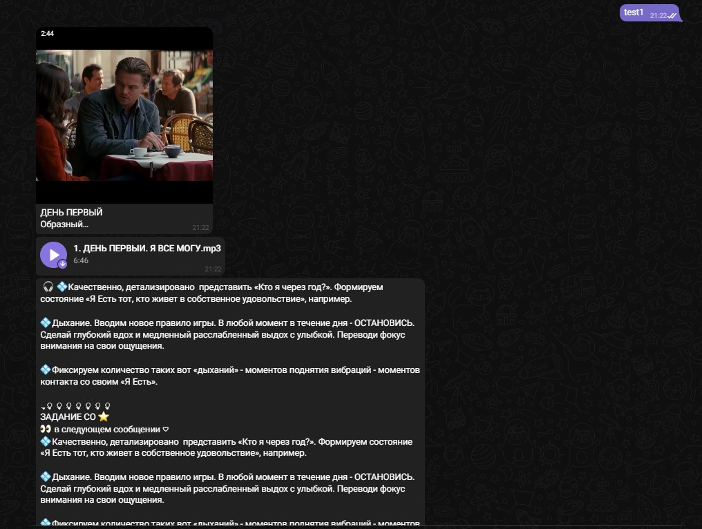

____
This **bot** is designed to send various notifications, content to the user, 
taking into account the specified time intervals, which allows you to **automate the interaction**
of the customer - administrator **with users - the audience.**
_____
##  Possibilities 
+ **Adding a new user to the database in the introductory part, to provide access to the main content.**
  + Access to the content is realized with the payment - donation, and acceptance of some rules by pressing interactive buttons. 
  The user is asked to pay towards payment details, with a request to send a check (screen or file) to the bot chat, 
  this check is automatically sent to the administrator, where he checks the payment, and confirms it by pressing 
  the button that appears in the chat (that change status of user in DB);
  + Part of the code and example of message:
~~~Python
def introduction(call):
    # Кнопка "button1" - "ИГРАЕМ?" при нажатии - вступительная часть.
    # В базе данных: добавление пользователя.
    if call.data == buttons["button1"]:
        with Session() as db:
            user = User(user_id=call.from_user.id,
                        user_name=call.from_user.username,
                        full_name=call.from_user.full_name)
            try:
                db.add(user)
                db.commit()
                markup_inline = types.InlineKeyboardMarkup(row_width=1)
                button2 = types.InlineKeyboardButton(text=buttons["button2"],
                                                     callback_data=buttons["button2"])
                markup_inline.add(button2)
                bot.send_message(call.message.chat.id, message_second_introduction, reply_markup=markup_inline)
            except Exception:
                markup_inline = types.InlineKeyboardMarkup(row_width=1)
                button6 = types.InlineKeyboardButton(text=buttons["button6"],
                                                     callback_data=buttons["button6"])
                markup_inline.add(button6)
                bot.send_message(call.message.chat.id, 'Странник, если ты хочешь снова пройти этот путь, '
                                                       'нажми кнопку "СОГЛАСЕН!", и игра в 21 день начнется сначала!',
                                                       reply_markup=markup_inline)
    # Кнопка "button6" - "CОГЛАСЕН" подтверждение пользователем начать "игру" сначала.
    # В базе данных: "обнуление" статусов пользователя.
    elif call.data == buttons["button6"]:
        user_id = call.from_user.id
        with Session() as db:
            user = db.query(User).filter(User.user_id == user_id).first()
            if user is not None:
                user.user_day = 0
                user.user_task = 0
                user.user_tz_shift = 0
                db.commit()
                markup_inline = types.InlineKeyboardMarkup(row_width=1)
                button2 = types.InlineKeyboardButton(text=buttons["button2"],
                                                     callback_data=buttons["button2"])
                markup_inline.add(button2)
                bot.send_message(call.message.chat.id, message_second_introduction, reply_markup=markup_inline)
    # Кнопка "button2" - "ПОЛУЧИТЬ ВХОДНОЙ БИЛЕТ" срабатывает после подтверждения перевода администратором.
    # В базе данных: статус "доната" - 1(оплачено), статус "доступа" - 2(доступ получен).
    elif call.data == buttons["button2"]:
        user_id = call.from_user.id
        with Session() as db:
            user = db.query(User).filter(User.user_id == user_id).first()
            if user is not None:
                if user.user_donate == 1:
                    user.user_access = 2
                    db.commit()
                else:
                    bot.send_message(call.message.chat.id, "Донейшн пока не обработан, после подтверждения перевода администратором,"
                                                           " тебе придет сообщение по дальнейшим действиям!")
                    return
~~~
  
+ **Requesting user locations, for save in database.**
  + The request for the user's location also occurs in the initial stage. The user receives a message in the chat of the bot,
  asking him to write the city of the location, which is saved in the database.
This allows content to be sent at specific time intervals according to the user's time zone;
  + Part of the code and example of message:
  ~~~Python
  def get_timezone(bot, chat_id, city):
    geo = geopy.geocoders.Nominatim(user_agent="SuperMon_Bot")
    location = geo.geocode(city)
    if location is None:
        raise TimezoneException("Не удалось найти такой город, попробуйте написать его название латиницей, "
                                "или указать более крупный город поблизости.")
    else:
        tzw = tzwhere.tzwhere()
        timezone_str = tzw.tzNameAt(location.latitude, location.longitude)  # получаем название часового пояса
        tz = pytz.timezone(timezone_str)
        tz_info = datetime.datetime.now(tz=tz).strftime("%z")  # получаем смещение часового пояса
        tz_info = tz_info[0:3] + ":" + tz_info[3:]  # приводим к формату ±ЧЧ:ММ
        bot.send_message(chat_id, "Часовой пояс установлен в %s (%s от GMT)." % (timezone_str, tz_info))
        tz_min = int(tz_info[0:3])*60 + int(tz_info[4:])
        return tz_min
  ~~~
  
+ **The ability to generate any content in the form of text, photos, audio, video, and links.**
  + Part of the code and example of message:
  ~~~Python
  def send_game_message(user_id, current_stage, user_day):
    if user_day == 1:
        if current_stage == 0:
            with open('days/1_day/1. main.mp4', 'rb') as f:
                bot.send_video(user_id, f, caption='ДЕНЬ ПЕРВЫЙ\nОбразный…', timeout=TIMEOUT, supports_streaming=True)
            with open('days/1_day/1. ДЕНЬ ПЕРВЫЙ. Я ВСЁ МОГУ.mp3', 'rb') as f:
                bot.send_audio(user_id, f, timeout=TIMEOUT)
                bot.send_message(user_id, message_1)
                time.sleep(10)
                bot.send_message(user_id, message_reminder_3)
            return 1, 1
        elif current_stage == 1:
            with open('days/1_day/1. reminder1.mp4', 'rb') as f:
                bot.send_video(user_id, f)
            with open('days/1_day/1. МГНОВЕННАЯ ОСТАНОВКА МЫСЛЕЙ.mp3', 'rb') as f:
                bot.send_audio(user_id, f, timeout=TIMEOUT)
                bot.send_message(user_id, message_1_1)
            return 1, 3
        elif current_stage == 3:
            with open('days/1_day/СУТЬ РЕАЛЬНОСТИ.mp3', 'rb') as f:
                bot.send_audio(user_id, f, timeout=TIMEOUT)
                bot.send_message(user_id, message_1_2)
            return 2, 0
  ~~~
    
+ **The appointment or change of the administrator is determined by entering and sending a message to the bot chat by the user,
namely: "admin1234", information about the administrator is stored in the database (there can be only one administrator).**
     
   ~~~Python 
            elif text == 'admin1234':
                if user.is_admin:
                    bot.send_message(user_id, 'Вы уже администратор.')
                else:
                    users = db.query(User).filter(User.is_admin==1).all()
                    for old_admin in users:
                        old_admin.is_admin = 0
                    user.is_admin = 1
                    db.commit()
                    bot.send_message(user_id, 'Изменения внесены.')
   ~~~
     
+ **Implemented a method for testing all content at a time, this requires entering the bot into the chat
'test1'.**
~~~Python 
def test_function(user_id):
    user_day = 1
    current_stage = 0
    while True:
        user_day, current_stage = send_game_message(user_id, current_stage, user_day)
        if user_day == 22 and current_stage == 3:
            bot.send_message(user_id, message_22_3)
            break
        time.sleep(5)
~~~

###  Usage 
1. download project;
2. set your token in the main.py file;
3. run on computer or server.

###  Used frameworks and libraries: 
+ pyTelegramBotAPI;
+ SQLAlchemy;
+ APScheduler;
+ pytz.

